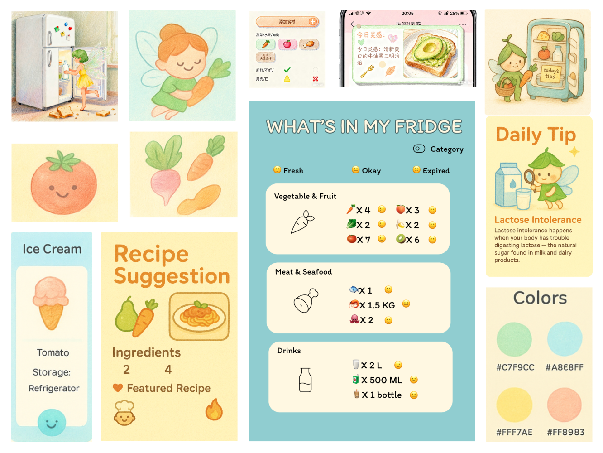
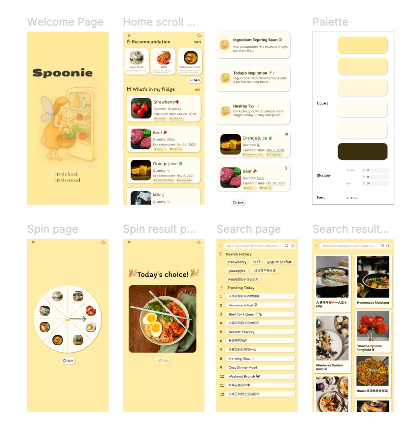

# MITID Assignment

An example of a final submission for the Designing with Web (DWW) and Connected Worlds & IoT (CWIOT) courses.
**The link to your repository must be submitted on Brightspace, under the Designing with Web course only!**

## What should be included in your repository

### For CWIOT

1.The complete code for your project, organized within a dedicated folder named cwiot.

Example folder structure:
```arduino
cwiot
├── projet-v1
│   ├── projet-v1.ino
│   └── config.h
│
└── projet-v2
    ├── projet-v2.ino
    └── config.h
```

Create a subfolder for each project iteration.

2.A schematic view of your project’s circuit.

3.A video or a set of photos showing your project in operation.

### For DWW

1.An image of your moodboard.

2.An image and/or a link to your Figma user flow.

3.The complete code for your project, organized within a dedicated folder named dww.

## My submission 

### CWIOT

#### Schematic view 


#### Photographs
Youtube Shorts demo of the color animation

<a href="https://youtube.com/shorts/kCc8VIG12Bs?si=Gv4OWngZY9dA2Xdy" 
   target="_blank">
   
</a>

### DWW

#### Moodboard

<<<<<<< HEAD

=======

>>>>>>> bf2b31e02da9204cf0360e88785a470cb3e36d5d

#### User flow 
[See the user flow in figma↗](https://www.figma.com/design/Qv7RDaX2VVylZdzTqxudub/Yao-Junyu---Assignment-1?node-id=0-1&t=qNNOzsJftcqaZUeB-1)

<<<<<<< HEAD



This code looks complicated because it does a lot of things. It’s not just a webpage that shows text — it’s an interactive mini-application. It lets users view recipes, add and delete food items, edit names, change pictures, save data, reopen the page and still see everything, and even connect to an IoT device that lights up red or green depending on whether food is expired.

To achieve all that, it’s divided into several parts:
	•	HTML: Decides what appears on the page, such as the top menu, recipe cards, fridge items, and the pop-up window for adding new items.
	•	CSS: Makes the page look nice, with colors, rounded corners, shadows, and button effects.
	•	JavaScript: Makes the page interactive. It handles things like opening the pop-up, adding and deleting food items, editing text, saving data, and making sure everything stays after refreshing the page.

It looks complex because all these features are written in a single file. Each function has to listen to user actions (clicks, typing, uploads), update the page content, and also save data locally at the same time.

I asked AI to help me write it because I wanted to create these features, but I couldn’t handle all this logic by myself. AI helped me build the structure, and then I learned step by step what each part does — like which section controls the pop-up, which one saves data, and which one connects to the IoT device. This process helped me really understand how a full webpage works.
=======

>>>>>>> bf2b31e02da9204cf0360e88785a470cb3e36d5d

